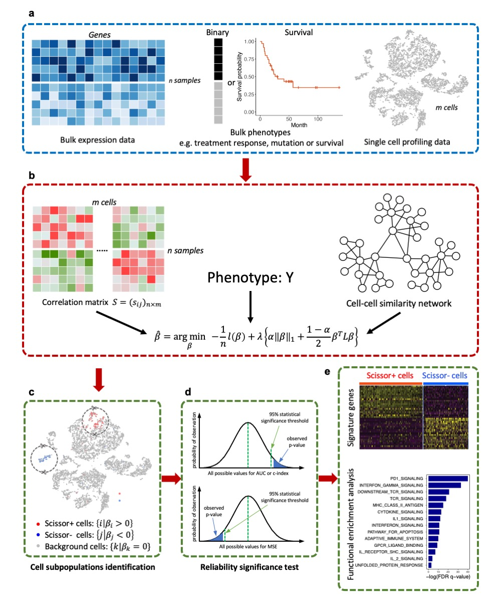

# Scissor: Single-Cell Identification of Subpopulations with bulk RNA-Seq phenotype cORrelation #

`Scissor` is a novel single cell data analysis approach. By leveraging bulk data and phenotype information, Scissor automatically selects a subset of cells from the single-cell data that is most responsible for the differences of phenotypes through a graph-regularized sparse regression model.

### How to cite `Scissor` ###
Please cite the following publication:

> *Duanchen Sun and Zheng Xia (2020): Phenotype-guided subpopulation identification from single-cell sequencing data.* 

### Installation ###

* Latest version: The latest developmental version of Scissor can be downloaded from GitHub and installed from source.
    + GitHub: https://github.com/sunduanchen/Scissor

### More information ###

The Scissor tutorial is available in package. Please see https://sunduanchen.github.io/RegSeq/Scissor_Tutorial.html for more details. To read the help documents in the R terminal please use the command `?Scissor`.
